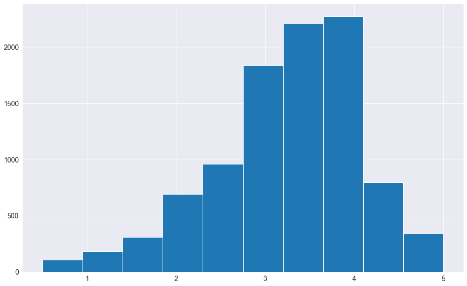
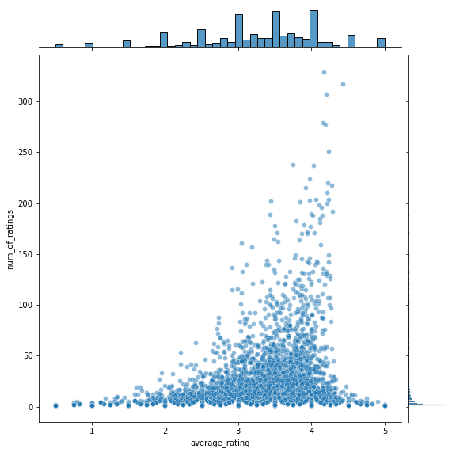
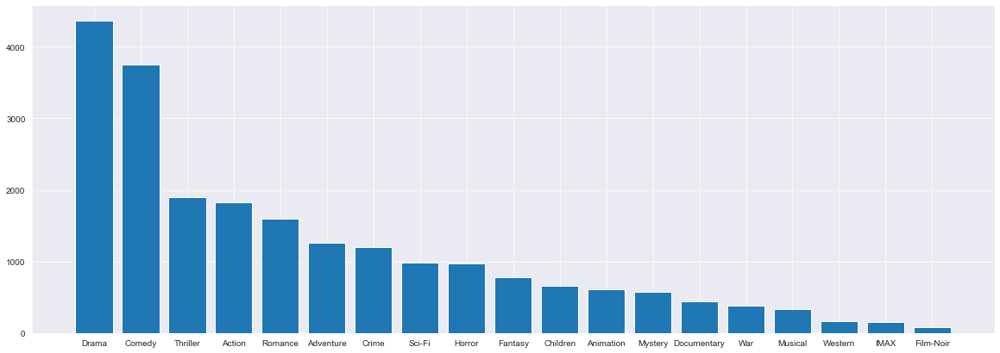
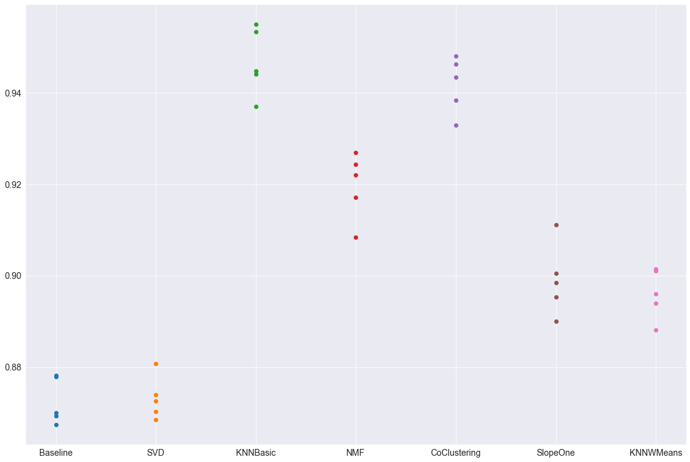
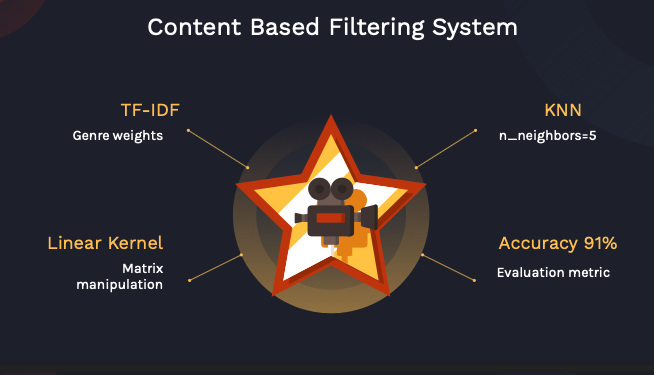

# WebFlix Recommendation System

**Authors**: Victor Chen, Brian Matsiko, Erin Vu

## Overview

Our project is a recommendation engine that uses collaborative filtering and content based filtering in order to recommend movies to users based off of movie ratings from the MovieLens dataset.


## Business Problem

Our stakeholder is a new movie streaming service trying to get into the media services business. In order to serve our customer base, we need to understand what they like and what to provide them. Our goal of this project is to build a model that provides the top 5 movie recommendations to a user, based on their ratings of other movies.

## Data

The data used in this set is from the MovieLens dataset. In this project, we will be working with the smaller dataset of 100,000 ratings of 9,000 movies from 600 users. We will use the ratings from the users to make recommendations for movies based off of other users ratings. The dataset was last updated on 9/2018. We are working towards a model that works on the smaller data set and hope to apply it to the larger dataset or another subset of the larget dataset with the same success.

***
Raw Data Ratings Distribution.


***
Raw Data Ratings Scatter.


***
Raw Data Genre Distribution.



## Methods

This project utilizes collaborative filtering as well as content-based filtering which is configured with TF-IDF to build movie recommendation systems for Webflicks.

***

## Results

***
Collaborative based Filtering recommendation system was built with algorithms from the surprise library with RSME from 10 fold cross validations being used as a metric to optimize the final model SVD.


***
Content based Filtering was mainly built for new users and new items as it utilizes the TF-IDF to refelct the importance of Genre in any movie and then uses the sum product of those weights as well as the user's preference towards different genres and then based on this sum product we can sort through movies and recommend the top 5 for each user.




## Evaluation

We were able to optimize our collaborative filtering model RMSE to .85 from .87. This means we minimized the measured distance of error between our predictions and our actual values. We explored other models but had higher scores for RMSE. For our content based model, we were able to reach an accuracy score of 91%. We believe if we were to implement our models into WebFlix, we would generate a growing userbase due to the unlimited factor of our movies along with a solid recommendation system to feed users new content

## Conclusion

Using our content based model in conjunction with our collaborative filtering model, we can show the top 5 movies to a new user signing up with their initial ratings while also listing the following recommendations for them to also explore. As users watch more movies and input ratings, we can further personalize their user experience to provide them with movie recommendations they would enjoy. Our analysis currently is on the small subset of the larger dataset. Our next steps would be to apply our model to a larger data set or a different subset of the data set to see how it performs on unseen data.

## For More Information

Please review our full analysis in [our Jupyter Notebook](./final_notebook.ipynb) or our [presentation](./slide_deck.pdf).

For any additional questions, please contact **Victor Chen victor.i.chen.98@gmail.com, Erin Vu erin.vu94@gmail.com, Brian Matsiko makryan77@gmail.com**

## Repository Structure

Describe the structure of your repository and its contents, for example:

```
├── README.md                          
├── working_final.ipynb  
├── slide_deck.pdf        
├── small_data                            
└── Images
└── Working_Notebooks
```
